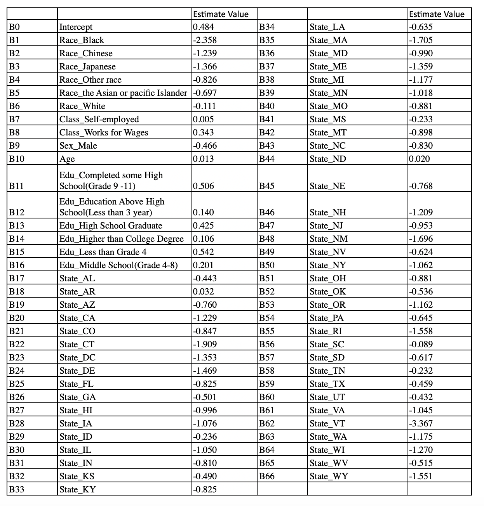

```{r setup, include=FALSE}
library(tidyverse)
# Loading in the cleaned survey Data
survey_data <- read.csv("survey_data.csv")

# Loading in the cleaned census Data
census_data <- read.csv("census_data.csv")


```


# Model
We choose to build a logistic regression by RStudio because we are interested in how predictor variables, such as race, sex, work class, education level, state, age, affect the probability of a person voting for Trump in the 2020 American Presidential Election. We pick state as one of the predictor variables because different states have different regulations and policies which further impact the vote results. In addition, we choose the work class as a variable because it can represent different social classes in the U.S. In conclusion, the logistics regression model is the proper model for us to see the probability of a random person who would like to vote for Trump. \newline

```{r, include=FALSE}

# Creating the Model
model1 <- glm(vote_trump ~race+class +sex +age +edu +state, data = survey_data, family = binomial)
# Model Results (to Report in Results section)
summary(model1)
# Create another model to see which one is better
model2 <- glm(vote_trump ~sex +age, data = survey_data, family = binomial)
summary(model2)

```


### Model Specifics
This is equation we get:\newline


$$ log(\frac{p}{1-p})= \beta_0+\beta_1  x_{raceBalck} + \beta_2 x_{raceChinese} + \beta_3 x_{raceJapanese} + ... + \beta_{66} x_{stateWY}$$

 P stands for the probability of a random person who would like to vote for Trump. For all 66 betas here, we have numerical variables like age and dummy variables like races and education levels. For example, the variable raceBalck represents that if the race of a random person is black, then the value of the term “ raceBalck” would be 1. Otherwise, it would be zero. The same logic applies to all dummy variables from B1 to B66. B1 to B66 in table1 represent coefficients in our equation. For instance, if a person is self-employed, then the odds that this person would like to vote for Trump will increase by 1.004. When all the betas from 1 to 66 are equal to 0, we will only see one item in the formula, and it will be B0 (0.483), which is the intercept. After we took the log-off, we calculated the odds of 62.2%. To illustrate, for a female who is 0 years old American Indian or Alaska Native, with a college degree and not available to work and she lives in Arkansas (AK), the odds that she will vote for Trump will be 62.2%. Please note that we will not have a person who is 0 years old with a college degree in reality, and the smallest age to participate in the election is 18.\newline
 \newline
Moreover, we used AIC for variable selection and model quality checking. “Akaike information criterion (AIC) (Akaike, 1974) is a technique based on in-sample fit to estimate the  goodness fit of a model, and a good model is the one that has minimum AIC among all the other models”[1]. We found that the AIC of our original model was 6575. To refer, we generated a new model by dropping three variables from the original model, and then we found that the AIC increased to 7046. We can see that our original model has a lower AIC. Therefore, our original model which contains six independent variables is the better model. \newline


### Post-Stratification 

We are looking for the proportion of people voting for Trump, so we choose to perform a post-stratification analysis. Moreover, post-stratification uses demographics to predict how the entire population in the U.S. will vote. Then, predict the proportion of voters in each group by applying the previously discussed model to the census data using the same predictor variables. Next, we weigh each proportion estimate by the respective population size of different variable groups and sum these values. Finally, we divide the sum by the total population size. The result is the predicted proportion of voting for Trump.

### Additional Information
In addition, we removed some of the observations from the raw census data before we employed logistic regression to the census data. The reason why we did that was there were some limitations to the voters. To explain, the voters have to be “U.S. citizens, and they also have to be at least eighteen years old”[12]. Therefore, we removed the observations which were non-citizens or under eighteen. Moreover, we made some adjustments to categorical simplification. For example, we shrunk the education level categories from eleven types to seven common types, which improved our data quality and increased overall productivity. Besides, we only kept the voters who voted for Biden or Trump because we would like to conclude their comparison. In other words, we took the probability of Biden winning as a reference to compare with. 

```{r,include=FALSE}

# Here I will perform the post-stratification calculation
census_data$logodds_estimate <-
  model1 %>%
  predict(newdata = census_data)

census_data$estimate <-
  exp(census_data$logodds_estimate)/(1+exp(census_data$logodds_estimate))
# get the final alp_predict
census_data %>%
  mutate(alp_predict_prop = estimate*perwt) %>%
  summarise(alp_predict = sum(alp_predict_prop)/sum(perwt))
#get the propotion for Biden
1-0.4442353


```


# Results
According to our post-stratification analysis, the estimated proportion of voting for Donald Trump is approximately 44.424%, and the estimated proportion of voters in favor of Joe Biden is approximately 55.576%.
Furthermore, the predicted result is modeled by a logistic regression model, which accounted for race, age, sex, education level, class of work, state.\newline
Table 1 shows the estimated beta values of our logistic model. 
\newpage

Table 1: Estimate for Betas \newline


# Discussion

### Summary
We made a logistic regression model based on survey data to predict the proportion of voting for Donald Trump. Next, we employed the model to the census data to predict the proportion of voters in each group. In addition, we grabbed the raw survey data from the website called Vote For Study Group, and we also grabbed the census data from the website called IPUMS USA. There are six variables in the model: race, sex, age, education level, work class, and state. Afterward, with these values, we weighed the proportion of voting for Trump with the corresponding population of each variable group. Then, we summed up these values. Finally, we divided the sum by the total population size. The result of 44.424% is the predicted proportion voting.\newline


### Conclusion
The estimated proportion of voting for Donald Trump is approximately 44.424%, and the estimated proportion of voting for Joe Biden is approximately 55.576%. Based on the analysis, we find that the proportion of Trump-voting is lower than the proportion voting for Biden. Therefore, Trump is less likely to win. Moreover, if Trump loses the election, then the democratic party will be in power. Fewer discrimination issues may happen in the U.S. because the democratic party cares more about human rights. 

### Weaknesses

* To see a significant proportion difference between votes for Trump and Biden, we clean all observations chosen other than Trump and Biden from the survey data, in other words, we assume people vote only for Trump or Biden. However, in the actual situation, some people will vote for others or choose not to vote. Thus our assumption is too ideal.
* We got census data for 2018 from two years ago, but the survey was built in 2020. The two sets of data are not obtained in the same year, which leads to the final prediction result not being accurate enough.
* Answers to the survey do not accurately reveal actual thoughts of respondents. Some people may lie or choose not to answer the question, then some rows of data do not make sense and will affect the final result.
* The outcome of the U.S. presidential election is not elected directly by popular vote. Instead, “they’re chosen by ‘electors’ through a process called the Electoral College, and it is possible to win the Electoral College but lose the popular vote”[6]. Thus, the way we conduct the final result is not the authentic way of the elected president in the U.S.
* The number of survey observations and questions are not large enough. The more observations and questions there are, the more accurate the final result there should be.


### Improvements

* When calculating the final result of the election, use the same way as the actual election process use, the Electoral College.
* We can design and implement a better survey with more useful questions and get as many respondents to take the survey.
* We can add more predictor variables since other factors would influence vote intentions of people. 
* We can use some other models to predict a more accurate result. For example, we can use a multilevel regression model. 


\newpage


# References
[1]“Akaike Information Criterion.” Akaike Information Criterion - an Overview | ScienceDirect Topics, www.sciencedirect.com/topics/medicine-and-dentistry/akaike-information-criterion. 

[2]“Dplyr.” Function | R Documentation, www.rdocumentation.org/packages/dplyr/versions/0.7.8/topics/case_
when. 

[3]Hadley Wickham and Evan Miller (2020). haven: Import and Export 'SPSS', 'Stata' and
         'SAS' Files. R package version 2.3.1. https://CRAN.R-project.org/package=haven

[4]“Ignore Files from Version Control.” Ignore Files from Version Control – Git Using RStudio, carpentries-incubator.github.io/git-Rstudio-course/02-ignore/index.html. 

[5]Logistic Regression, www.cookbook-r.com/Statistical_analysis/Logistic_regression/. 

[6]“Presidential Election Process.” USAGov, www.usa.gov/election. 

[7]Sharon McMullenSharon McMullen 5311 gold badge11 silver badge55 bronze badges, et al. 
“Plotting a Multiple Logistic Regression for Binary and Continuous Values in R.” Stack Overflow, 1 July 1965, stackoverflow.com/questions/36942443/plotting-a-multiple-logistic-regression-for-binary-and-continuous-values-in-r. 

[8]“Statistical Modeling, Causal Inference, and Social Science.” Statistical Modeling, Causal Inference, and Social Science:statmodeling.stat.columbia.edu/2020/01/10/linear-or-logistic-regression-with-binary-outcomes/. 

[9]Team, MPC UX/UI. “U.S. CENSUS DATA FOR SOCIAL, ECONOMIC, AND HEALTH RESEARCH.” IPUMS USA, 
usa.ipums.org/usa/index.shtml. 


[10]“United States Presidential Election.” Wikipedia, Wikimedia Foundation, 30 Oct. 2020,\newline en.wikipedia.org/wiki/United_States_presidential_election. 

[11]Venables, W. N. & Ripley, B. D. (2002) Modern Applied Statistics
  with S. Fourth Edition. Springer, New York. ISBN 0-387-95457-0

[12]“Who Can and Can't Vote in U.S. Elections.” USAGov, www.usa.gov/who-can-vote. 

[13]Wickham et al., (2019). Welcome to the tidyverse. Journal of Open
  Source Software, 4(43), 1686, https://doi.org/10.21105/joss.01686


